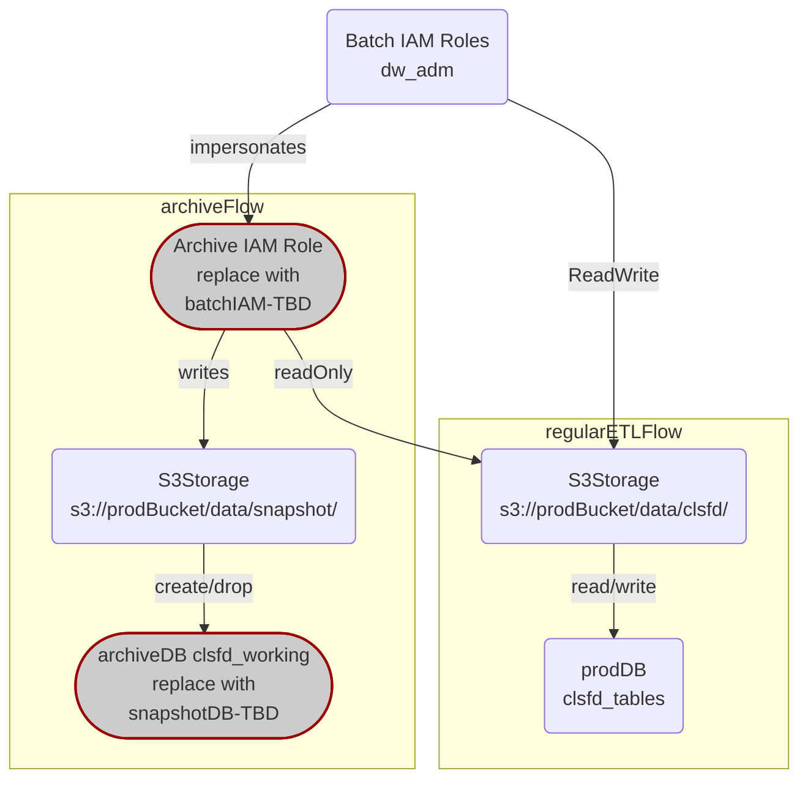

```mermaid
graph TD
    dw_adm(Batch IAM Roles<br>dw_adm)-->|ReadWrite|Prod
    dw_adm-->|impersonates|archiveBatchRole([Archive IAM Role<br>replace with<br>batchIAM-TBD])
    subgraph regularETLFlow
        Prod("S3Storage<br>s3://prodBucket/data/clsfd/")-->|read/write|prodTables(prodDB<br>clsfd_tables)
    end
    subgraph archiveFlow
        archiveBatchRole--> |readOnly|Prod
        archiveBatchRole--> |writes|ArchiveStorage("S3Storage<br>s3://prodBucket/data/snapshot/")-->|create/drop|archiveTables([archiveDB clsfd_working <br>replace with<br>snapshotDB-TBD])
    end

     style archiveBatchRole fill:#ccc,stroke:#900,stroke-width:2px
     style archiveTables fill:#ccc,stroke:#900,stroke-width:2px
```
