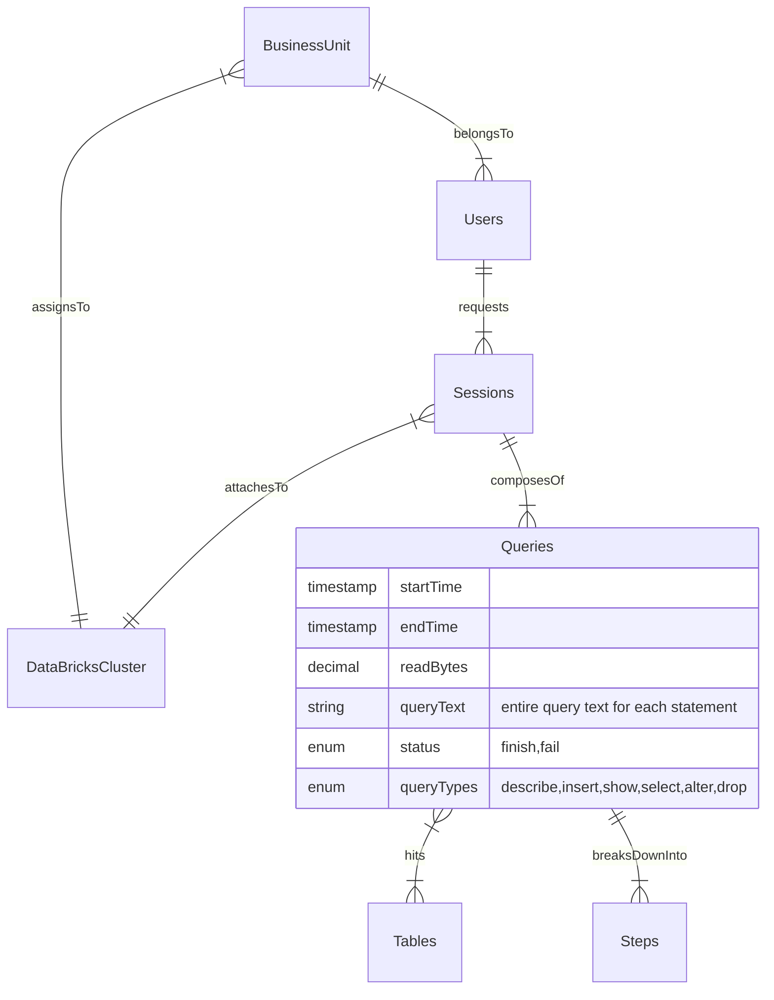

```mermaid
erDiagram
    BusinessUnit ||--|{ Users:belongsTo
    BusinessUnit }|--|| DataBricksCluster:assignsTo
    Users||--|{ Sessions:requests
    Sessions ||--|{Queries:composesOf
    Sessions }|--||DataBricksCluster:attachesTo
    Queries }|--|{Tables:hits
    Queries ||--|{Steps:breaksDownInto


%% number of queries per hour - peak capacity 
    Queries {
    timestamp startTime
    timestamp endTime
    decimal readBytes
    string queryText "entire query text for each statement"
    enum status "finish,fail"
    enum queryTypes "describe,insert,show,select,alter,drop"
}

```
