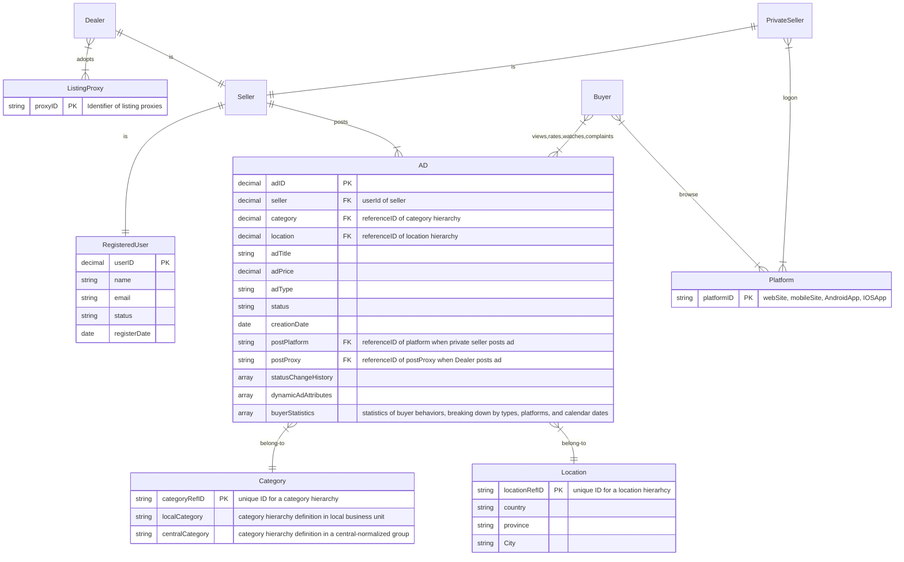

```mermaid
erDiagram
%% A conceptual model relating Ad domain
%% Including
%% DW_CLSFD_AD, CLSFD_AD_STS_CHNG_HST, CLSFD_AD_ATTR_MAP, CLSFD_AD_ATTR_LKP
%% CLSFD_STATS_SNPSHT, CLSFD_AD_CHNL, DW_CLSFD_PROXY

%% referencing
%% DW_CLSFD_USER, CLSFD_PLTFRM_LKP
%% DW_CLSFD_{meta,Lvl2,Lvl3,Lvl4}_Categ_Lkp
%% DW_CLSFD_{meta,Lvl2,Lvl3,Lvl4}_Geo_Lkp

    Dealer }|--|{ ListingProxy : adopts
    Dealer ||--|| Seller : is 
    
    PrivateSeller ||--|| Seller : is 
    PrivateSeller }|--|{ Platform: logon
    
    Seller ||--|| RegisteredUser :is
    Seller ||--|{ AD : posts
    
%% put Ad in mid of Buyer & seller in the final layout
    Buyer }|--|{ AD: "views,rates,watches,complaints"
    Buyer }|--|{ Platform: browse
   
    AD }|--|| Category : belong-to
    AD }|--|| Location : belong-to
    
    RegisteredUser{
        decimal userID PK
        string name
        string email
        string status
        date registerDate
    }
    
    ListingProxy{
       string proxyID PK "Identifier of listing proxies" 
    }
    
    Platform {
        string platformID PK "webSite, mobileSite, AndroidApp, IOSApp" 
    }
    AD{
        decimal adID PK
        decimal seller FK "userId of seller"
        decimal category FK "referenceID of category hierarchy"
        decimal location FK "referenceID of location hierarchy"
        string adTitle
        decimal adPrice
        string adType 
        string status
        date creationDate
        string postPlatform FK "referenceID of platform when private seller posts ad"
        string postProxy FK "referenceID of postProxy when Dealer posts ad"
        array statusChangeHistory
        array dynamicAdAttributes
        array buyerStatistics "statistics of buyer behaviors, breaking down by types, platforms, and calendar dates"
    }
    Category{
    string categoryRefID PK "unique ID for a category hierarchy"
    string localCategory  "category hierarchy definition in local business unit"
    string centralCategory "category hierarchy definition in a central-normalized group"
    }
    Location{
    string locationRefID PK "unique ID for a location hierarhcy"
    string country
    string province
    string City 
    }
    
```
